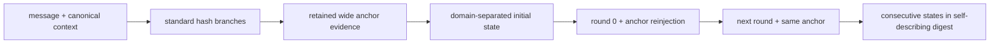

# Sigma: A Framework for Wide Input Commitments and Round-Separated Multi-State Hash Iteration

Working manuscript — v2-2 alpha, 2026-09-03. This document reports internal
analysis and preliminary smoke experiments, not an external security review.

## Abstract

We describe Sigma v2-2, an experimental framework that separates a canonical
wide commitment to an input from an anchor-reinjected sequence of hash
transitions and publishes consecutive states. The redesign addresses ambiguity
and backend-dependent behavior found in an earlier prototype. Its principal
engineering contribution is a byte-level specification shared by streaming,
tree and multiprocessing implementations. Its analytical contribution is a
conditional random-oracle account of non-coalescence and multi-state collision
bounds: when two trajectories have different anchors but meet at one state,
reinjection makes their next queries distinct, whereas an ordinary chain sends
the same query. This does not make the output a proof of sequential work and
does not overcome the effective collision width of the anchor. We provide a
reference Python implementation, independent vectors, an automated regression
suite and a reproducible experiment harness. Preliminary reduced-width and
systems smoke
runs exercise 72,013 observations across canonicality, collisions, dependency,
diffusion, distribution, timing, memory and scoped application studies. These
runs validate methodology and implementation paths only; full confirmatory
campaigns and independent cryptanalysis remain future work.

## 1. Introduction

Iterated hashing mixes several quantities that should be kept distinct:
cryptographic work, adaptive depth, physical state width, output length and
input entropy. Repeating a public hash increases honest evaluation work, but it
does not by itself create password entropy, memory hardness, authentication or
a succinct proof that all previous rounds were executed. Likewise,
concatenating several hash outputs can give a conservative robust-combiner
property, while compressing them immediately returns the construction to the
collision bound of the compressed output.

Sigma v2-2 is therefore framed narrowly as an **input-bound, round-separated
iterated hash combiner with a multi-state trajectory commitment**. It has four
design rules:

1. encode every suite parameter canonically and authenticate it;
2. preserve standard branch roots in the anchor rather than trusting a custom
   narrow mixer;
3. inject the complete anchor, context and round index into every transition;
4. return full consecutive states in a self-describing digest.

The contributions are a frozen wire construction; StreamWide, CrossWide and
TreeWide anchors; WideOnce and Deep transitions; deterministic execution
backends; explicit reductions TH-01–TH-08; and a data-first experiment pipeline.
We make no claim of production readiness, post-quantum security, constant-time
execution, ASIC resistance, or novelty equivalent to a proof-of-sequential-work
protocol.

## 2. Preliminaries and threat models

The collision adversary chooses two distinct canonical `(context,message)`
pairs. A target adversary is given a digest target. A backend-conformance
adversary looks for adapter, chunking or worker choices that change a value for
the same byte input and suite. The reduced experiments instantiate deterministic
pseudorandom functions at small widths; the formal transition arguments use an
ideal random oracle. Concrete hash functions are treated through ordinary
collision/preimage assumptions, not as proved independent oracles.

For low-entropy inputs, an attacker may enumerate a ranked dictionary. The
framework is public and deterministic, so it adds per-guess cost but no entropy.
Password hashing requires a memory-hard KDF; Argon2id is specified for that
purpose in [RFC 9106](https://www.rfc-editor.org/rfc/rfc9106.html).

## 3. Construction



### 3.1 Canonical context

`SigmaContextV2` is a strict, length-delimited TLV record containing suite,
anchor, round and output profile identifiers; target round `t`; state count `k`;
ordered branch identifiers; tree leaf size; salt; challenge; and application
context. Unknown, reordered, duplicate, missing, truncated and trailing fields
are rejected. Backend, read buffer and worker count are deliberately absent.

### 3.2 Wide anchors

StreamWide feeds the same framed message into every registered branch and keeps
all roots. CrossWide retains those roots and adds one connection digest per
branch over the complete root vector. The connections are credited with
diffusion, not extra conservative collision strength. TreeWide uses fixed
65,536-byte leaves and canonical range/height/length node framing. Its frontier
stores at most one perfect subtree per power of two and never duplicates an odd
node. Although its recursive split resembles history trees, Sigma Tree v2-2 is
not the Certificate Transparency construction defined by
[RFC 6962](https://www.rfc-editor.org/rfc/rfc6962.html).

The registered branches are SHA-512 from
[FIPS 180-4](https://csrc.nist.gov/pubs/fips/180-4/upd1/final), SHA3-512 and
SHAKE256 from [FIPS 202](https://csrc.nist.gov/pubs/fips/202/final), and
BLAKE2b-512 from [RFC 7693](https://www.rfc-editor.org/rfc/rfc7693.html). SHA3
and SHAKE share Keccak structure; branch names are not evidence of
independence.

### 3.3 Anchor-reinjected rounds

For encoded context `C`, anchor evidence `A`, state hash `F` and domain-separated
encoding `E`:

```text
S_0     = F(DST_init  || E(C,A))
S_(i+1) = F(DST_round || E(C,i,A,S_i))
D_(t,k) = E(C,S_t,...,S_(t+k-1)).
```

Deep replaces each transition with parallel branch evaluations followed by a
SHA3-512 fold. DeepVector instead retains every branch component and makes each
successor component consume the complete previous vector. Branches at a level
may run concurrently; levels remain adaptive.
The binary digest carries the complete context and exactly `k` equal-width
states. JSON and hexadecimal are presentation wrappers around those bytes.

## 4. Security analysis

The complete statements, games, reductions and limitations are in
[`specification/security-analysis.md`](../specification/security-analysis.md).
In summary:

- TH-01 proves injective accepted encodings and defines backend conformance.
- TH-02 reduces a retained-root anchor collision to branch collisions.
- TH-03 proves distinct next queries after a collision under unequal anchors.
- TH-04 bounds segment collisions by anchor advantage plus a conditional
  `binom(q,2) 2^(-kn)` RO term and an explicit non-ideal `epsilon`.
- TH-05 decomposes second-preimage success into an anchor term and a segment
  term; it does not derive second-preimage strength from collision resistance.
- TH-06 treats target preimage as a separate regular-image model, capped by
  the source entropy, and accounts explicitly for multiple targets.
- TH-07 states the work/span DAG of each evaluator without claiming a universal
  sequentiality lower bound.
- TH-08 reduces signed-record reuse to Ed25519 or encoding failure and explains
  why one valid edge does not establish its trajectory prefix.

Robust hash combiners motivate retaining roots: Boneh and Boyen show limits on
short black-box collision-resistant combiners that evaluate their components
once ([CRYPTO 2006 author page](https://crypto.stanford.edu/~xb/crypto06b/)).
The inclusion of context, counters and salts is conceptually related to the
HAIFA framework, while Sigma's construction and claims are different
([Biham–Dunkelman](https://eprint.iacr.org/2007/278)). A real proof of sequential
work has a protocol and efficient public proof, as in Cohen and Pietrzak
([EUROCRYPT 2018](https://eprint.iacr.org/2018/183)); publishing adjacent Sigma
states is not such a proof.

## 5. Execution profiles and reference library

Lightweight uses a two-branch constant-memory StreamWide anchor; real-time
incremental processing is an execution policy over that same v2.2 suite.
Simultaneous uses the four-branch canonical tree and can distribute leaves
without changing semantics. Paranoid Wide retains four roots plus four
connections. Paranoid Deep uses the same CrossWide evidence and evaluates all
four branches at each level; Paranoid DeepVector retains the four-component
state instead of folding it. These names describe execution profiles, not
security grades.

The serial backend is normative. The multiprocessing backend hashes canonical
tree leaves in bounded batches and reduces them with the serial tree algorithm.
File paths and descriptors are checked for identity/metadata changes, and
multiprocessing uses a private immutable snapshot. Incremental finalization is
explicit; checkpoints are marked provisional. A full verifier recomputes the
input, anchor and trajectory. The adjacent verifier is deliberately named and
documented as insufficient for history.

## 6. Experimental methodology

Every experiment uses a versioned JSON configuration and public master seed.
Labelled SHA-256 derivation creates independent deterministic PRNG streams. The
runner writes one gzip-compressed CSV row per observation, a derived JSON
summary, and a manifest containing commit, dirty state, command, configuration
hash, OS, CPU/RAM, affinity, Python and dependency versions. Artifact hashes are
SHA-256. Existing committed runs are exploratory smoke runs; confirmation
requires clean commits, preregistered full configurations, additional hosts and
archival publication.

The v2-2 pilot configurations add causal controls, survival analysis, exact
intervals, robust regressions, real primitive-input instrumentation, six
precomputation attackers and separate collision/preimage/second-preimage games.
Their outputs size and test the protocols; they are deliberately not substituted
for clean-tag confirmatory datasets in the results below.

EXP-01 compares complete context, anchor, transcript and digest across adapters
and workers. EXP-02–04 use reduced oracles for collision and anchor questions.
EXP-05/07 perturb the real v2 implementation and retain exact XOR masks. EXP-08
publishes every frequency/runs/serial p-value and applies a family correction.
EXP-09 randomizes task order, warms each implementation and separates memory,
file, anchor, round, serialization and verification timing. EXP-10 uses fresh
processes and reports Python allocations separately from scoped process RSS.

## 7. Preliminary smoke results

The selected historical run manifests under `experiments/results` contain
72,013 raw
observations. EXP-01 found no divergence in 266 observations spanning five
presets, nine boundary sizes and tree worker counts 1, 2, 3, 4 and 8.

At reduced width, EXP-02 exhibited the registered bottleneck mechanism. For
`n=8,k=2,a=16`, a reinjected consecutive segment had median log2 work 8.02
against the preregistered value 8; with `a=8`, work saturated near 4.32. A simple
chain did not gain the corresponding `k` factor. These are small simulations,
not concrete security estimates.

EXP-03 observed conditional persistence compatible with the exact binomial
model for all twelve smoke groups. A simple chain persisted in every trial. For
reinjection at `n=4`, observed one-step persistence was 0.06372 against 0.0625;
the exact two-sided p-value was 0.747. Wider/longer groups often had zero events,
as expected at the limited sample size.

EXP-04 made the narrow-anchor effect visible. With three normal 8-bit branches,
median log2 collision work was 4.31 for the 8-bit compressed control, 12.36 for
concatenated roots and 12.48 for CrossWide in this run. Deliberately colliding
one branch produced no complete anchor or digest collision in the sampled wide
constructions. The framing control collided under raw variable concatenation
and remained distinct under length framing.

EXP-05 recorded 1,240 component perturbations; every sampled root, connection,
state, index and context perturbation changed the digest, and suite validation
rejected both branch ablation and permutation. Cryptographic layers had mean
flip rates near one half. EXP-07 expanded this to 6,656 layer-separated SAC
observations. The preregistered conservative power calculation requires at
least 2,540 samples per input bit for 512-bit layers at detectable bias 0.05,
whereas the smoke run has 32 and is explicitly underpowered. No
cryptographic-layer cell survived Bonferroni correction; the full framed anchor
correctly exposed constant structural bits, illustrating why framing bytes
must not be scored as if they were hash output.

EXP-08 generated 10,752 distinct outputs across seven constructions and three
structured/adversarial corpora. None of the 84 published tests failed its
Bonferroni threshold. Passing these tests is not evidence of collision or
preimage security.

EXP-06's exact accounting matched `t+k-1` adaptive levels. Threads reduced
throughput for these very small Python tasks, so no scaling benefit is claimed.
EXP-09 retains 990 timing observations but has only three repeats per cell and
uncontrolled page cache; it validates the pipeline, not stable performance
rankings. EXP-10 selected a constant allocation model for StreamWide and a
logarithmic model for TreeWide and the parallel parent process through 4 MiB.
That historical run did not measure child-worker aggregate RSS and it is not
inferred; the revised EXP-10R pilot now samples aggregate parent/child RSS on
Linux, but remains excluded from these historical result claims.

EXP-11 evaluated 384 reduced-difficulty PoW trials. All three predicates were
configured for ideal acceptance probability 1/16; their observed mean attempts
were 17.91 (one state), 17.03 (two 2-bit predicates) and 18.52 (4-bit
concatenation), each within the preregistered four-standard-error smoke bound.
EXP-12 made 24 small dictionary-timing observations. Sigma post-processing
reduced measured Argon2id guess rate by factors from 1.03 to 1.19 on this host;
this is overhead and transcript binding, not additional entropy or memory
hardness.

EXP-14 detected all 384 injected message, anchor-root and published-state bit
faults by changed output or complete recomputation. This is fault coverage, not
DFA. EXP-15 proves only the structural fact that legacy `Psi` compresses 2048
input bits to 512 output bits and hence is non-bijective. Its 256 sampled
single-bit differentials averaged 256.52 changed bits, close to the SHA-512
control's 256.28, while reduced 8/12/16-bit prefixes collided after 17/114/300
candidates in this seed. Diffusion does not establish collision resistance.

Regenerated data-derived figures are stored under [`paper/figures`](figures/),
with a manifest binding every SVG to the selected run summaries/raw data.

## 8. Application scope

The alpha PoW application currently composes the frozen reference v2.1 suite
and canonically binds a non-empty challenge, `t`, `k`,
predicate and difficulty, and encodes payload and 64-bit nonce without framing
ambiguity. It supports a leading-zero predicate on one state, two predicates on
the first two states, or one predicate on their concatenation. Verification
recomputes the full digest and is not cheap or succinct. Nonces remain freely
parallelizable; challenge reuse permits ordinary precomputation, and callers
must enforce acceptable parameter floors to prevent downgrade.

The optional KDF composition first evaluates Argon2id v1.3 through
`argon2-cffi`, then hashes its output in a Sigma context binding salt and all
Argon2 parameters. Registered v2-2 Wide, CrossWide, Deep and DeepVector
post-processing modes preserve the same Argon2 budget. The signed commitment
profile uses standard Ed25519 over context, anchor and states and distinguishes
attestation, full recomputation and one-edge checking; Sigma is not a signature.

## 9. Limitations and open cryptanalysis

The implementation is Python and not constant-time. The branch set shares
design structure and receives no additive-strength claim. Reduced-oracle data
does not extrapolate directly to 512-bit instantiations. Multi-state output is
bounded by anchor strength. TreeWide is new domain-separated composition code
and needs dedicated review. `Psi` is a non-bijective legacy compression mixer
retained only for cryptanalysis. No native core, leakage traces, RTL, synthesis,
energy data, native leakage study, complete `Psi` cryptanalysis or quantum
reduction currently exists. The PoW/KDF/fault/`Psi` results are small internal
smoke studies and have not crossed those external-review or confirmatory gates.

## 10. Reproducibility

The repository contains the frozen specification/vector, experiment configs,
raw smoke observations, summaries and manifests. `python -m
experiments.reproduce --config CONFIG --output NEW_DIRECTORY` regenerates a
run; `python -m experiments.reproduce_all` reproduces the historical EXP-01–10
selection and its figures. Revised campaigns use the individual configs under
`experiments/configs/pilots`. The core runtime has no third-party dependency;
Argon2 support is an optional extra. An exact Python 3.13 analysis
constraint snapshot is supplied. Release tooling builds wheel/sdist, SHA-256
checksums and a CycloneDX SBOM. A final artifact release must be generated from
a clean tagged commit and archived with a DOI; the current dirty-state manifests
are deliberately unsuitable for that claim.

## 11. Conclusion

Sigma v2-2 replaces an ambiguous prototype with a testable construction whose
encoding, anchor evidence, transition inputs and limitations are explicit.
Anchor reinjection changes conditional collision persistence in the idealized
model, and consecutive states impose multiple equalities only up to the anchor
bottleneck. The strongest current result is therefore architectural and
conditional, not a declaration of a new production cryptographic primitive.
Full campaigns and independent review determine whether the framework merits
further standardization or deployment work.
